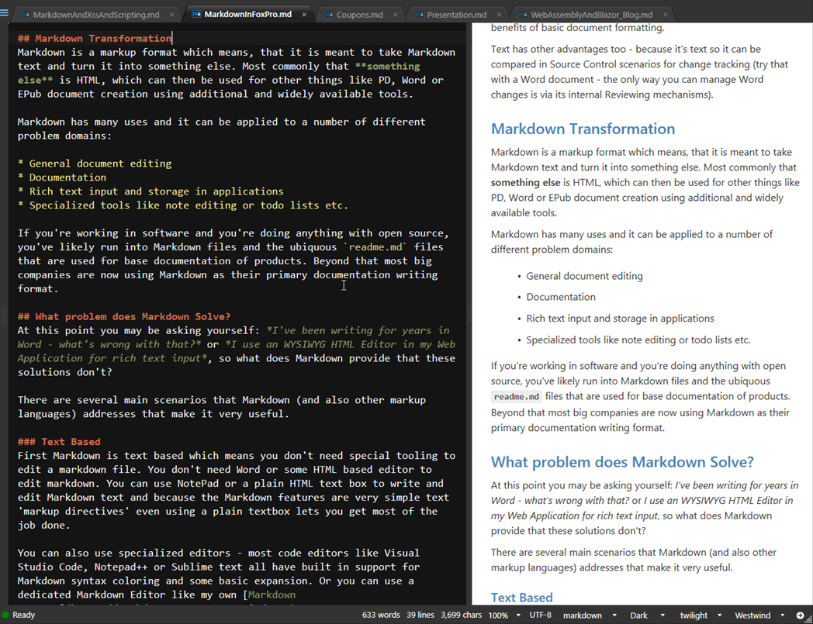

class: center, bmiddle
background: background.jpg

# Marking up the World with Markdown
### taking back control from WYSIWYG editing

by Rick Strahl

.right[West Wind Technologies]
.right[[@RickStrahl](https://twitter.com/rickstrahl])
.right[rstrahl@wwest-wind.com]

---

class: center, bmiddle
background: background.jpg

# What is Markdown

* **Markup Text Language**
	* Text based markup language
	* Very easy to learn
	* Uses simple symbols to represent common HTML concepts
	* Very typable
	* Great for developer related text

* **Markdown and HTML**  
	* Markdown only supports limited HTML features
	* But you can embed and mix-in HTML
	* Markdown provides most common editing features

---

class: center, bmiddle
background: background.jpg

# What does Markdown Look like?

